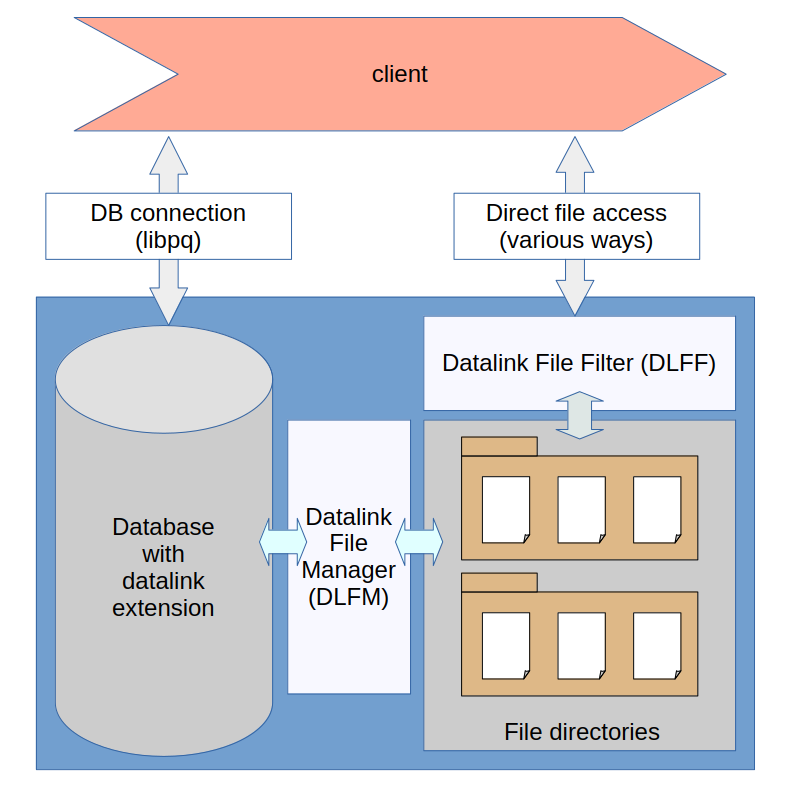

Datalink manual
===============

Use Cases
---------

Datalinks are useful, where data are kept in files, together with metadata in SQL tables.
This can provide SQL query capabilities for files within SQL.

There are a number of reasons one might want to keep some data in files insted of storing it in a database:

- some files are very large and actual contents are not really needed in a database
- one wants to keep the original data files
- access to files from outside the database
- files are very heavily used in all sort of web servers
- avoid overloading the database infrastructure with file contents
- file content can often be streamed directly to the client

Some disciplines, which usually handle external files together with SQL data:

- World Wide Web publishing, where parts of the website are often served as files
- Creative industries, where production assets are kept in multimedia files
- CAD/CAM, where models and schematics are kept in files
- Content delivery, where streaming assets are kept in files
- Administration, where files are used to keep PDF documents and such
- Medical, where X-ray and other scans are kept in files

Datalink Concepts:
- Files are referenced through new DATALINK type
- Database system has control over external files
- No need to store file contents in database system
- Access control and ACID mechanisms of DBMS can be extended to file system

Benefits of datalinks:
1. Does not require physically moving files stored on a file system into the database in order
 to gain the benefits of database's robust management capabilites. 
 Turning over the responsibility for managing referential integrity to the database minimizes
 the opportunity for integrity errors between external files and database data.
2. Eliminates the need to develop and maintain homegrown custom software to manage referential
 data integrity between the database and the file system.
3. The ability to maintain performance and speed of access by locating external files in close
 proximity to applications, and to continue using the file system directly for read and write operations.

Datalinks are a part of [SQL/MED (Management of External Data)](https://en.wikipedia.org/wiki/SQL/MED) 
standard [ISO/IEC 9075-9](https://www.iso.org/standard/84804.html).

The standard states: "The purpose of datalinks is to provide a mechanism to synchronize the 
integrity control, recovery, and access control of the files and the SQL-data associated with them. "
Effectively, it attemps to extend ACID database properties to external files.

Datalinks provide an interesting and viable alternative to large objects.

DATALINK is special SQL type intended to store references to external files in the database.
Only references to external files are stored in the database, not the content of the files themselves.
Files are addressed with [Uniform Resource Locators (URLs)](https://en.wikipedia.org/wiki/URL).

Datalinks as defined by SQL/MED standard should provide:

- [DATALINK SQL datatype](type.md)
- [SQL scalar functions operating on DATALINK type](functions.md)
- [Transactional semantics](transactions.md)
  - [Integrity](integrity.md)
    - [URI syntax validation](type.md)
    - [Checking if file exists](integrity.md)
    - [Protection of linked file against renaming or deletion](access.md)
    - [Automatic deletion of files no longer referenced from database](recovery.md)
  - [Access control](access.md)
    - [Read access control through database](access.md)
    - [Write access control through database](access.md)
  - [Point-in-time recovery of file contents](recovery.md)
- [Access to files on different servers](foreign_server.md)

This extension provides a number of additional features:
- [URI manipulation](functions.md#user-content-uri-manipulation)
- [File system to URL mapping](dlff.md)
- [Web access via CURL](functions.md#user-content-web-access)
- [File reading and writing](functions.md#user-content-reading-files)
- [Enable file access for non superuser database roles](security.md)
- [Directory permissions system](configuration.md)
- [Compatibility functions](functions.md#user-content-compatibility-functions)

Architecture
------------

The datalink system is made of these three main components:

- a PostgreSQL extension `datalink` to be used from SQL, providing DATALINK within SQL environment. The extension by itself does not perform any potentionally destructive file system changes, although it can create new files if allowed by the file system permissions. 
- [Datalink File Manager](dlfs.md) (DLFM) deamon, [`pg_datalinker`](pg_datalinker.md), which handles all file manipulations. 
The extension can be used without a daemon, but this disables some of the functionality.
- [Datalink File Filter](dlff.md) (DLFF), which applies READ ACCESS DB policy to file accesses. 

Reference
---------
- [Configuration](configuration.md)
- [Security](security.md)
- [Caveats](caveats.md)
- [Errors](errors.md)
- [Extending datalink](extensions.md)
