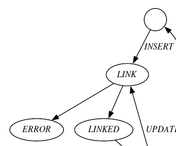

[Datalink manual](README.md)

pg_datalinker
=============

*pg_datalinker* is a Datalink File Manager deamon, which normally runs
in the background.

It is not meant to be run directly, but rather managed with [`dlfs`](dlfs.md) command.

Datalinker uses entries in `datalink.dl_linked_files` table.
Here it sees the results of transactions already commited in postgres.

It then attempts to modify linked files accordingly.

It also deletes (purges) temporary and aborted files 
created from postgres with `datalink.write()`, `datalink.write_text()` 
and `dlreplacecontent()` and such functions.

It needs to run as UNIX superuser `root` because it needs to 
change file ownership and permissions and whatnot.

Responsibilities
----------------
* Protect files from renaming or deletion (WRITE ACCESS BLOCKED or TOKEN or ADMIN)
  
  This is done by setting the *immutable* flag on the file with `chattr +i` command.
  This prevents file from being renamed or modified, even by root.
  Datalinker itself must run as root to change file attributes.
  
* Make backups of files (RECOVERY YES)

  *Base file* is designated by path, for example `/dir1/dir2/file.ext`.

  *Backup file* is base file with appended token, such as `/dir1/dir2/file.ext#ae3cc23d-7a87-419a-b2f8-e6dc9d682d33`.

  If backup file does not exist, it is created by creating a *copy* of base file.

* Restore files from backups (RECOVERY YES)

  *Base file* is designated by path, for example `/dir1/dir2/file.ext`.

  *Backup file* is base file with appended previous token, such as `/dir1/dir2/file.ext#ae3cc23d-7a87-419a-b2f8-e6dc9d682d33`.

  Base file is replaced by linking backup file as base file.
  
* Replace files with new versions (WRITE ACCESS TOKEN or ADMIN)

  *Base file* is designated by path, for example `/dir1/dir2/file.ext`.

  *New file* is base file with appended new token, such as `/dir1/dir2/file.ext#ae3cc23d-7a87-419a-b2f8-e6dc9d682d33`.

  Base file is replaced by linking new file as base file. *New file* will be deleted unless RECOVERY YES is also specified.
  
* Make files owned by database (READ ACCESS DB)

  File owner is set to the user `postgres`, making a file effectively owned by the postgres server process.
  File group is set to `www-data`, making file readable to apache web server.
  File mode is set to 0440, making file unreadable by normal users.
  Previous protection is stored in `datalink.dl_linked_files` table.

* Restore file permissions (ON UNLINK RESTORE)

  File owner, group and mode are restored from values previously stored in `datalink.dl_linked_files` table.

* Delete files no longer referenced (ON UNLINK DELETE)

* Purge files created from postgres

  This deletes files created by `datalink.write()` and such if the transaction was aborted or
  if the transaction was commited and file is temporary. File must also be owned by the user `postgres`.

Datalinker connects to postgres service "datalinker", so make sure it is configured
in file `/etc/postgresql-common/pg_service.conf`.

Files in state `LINK` go into state `LINKED` when successfully linked otherwise they go into state `ERROR`.

Files in state `UNLINK` are unlinked and deleted from table `datalink.dl_linked_files`.
If `ON_UNLINK` is `DELETE` then the files are also deleted from filesystem.

Options
-------
$opt_O: if owner (of the table containing the datalink column) 
is equal to an existing OS user, it is set as the owner of the file thus making it readable to 
that user. This is meant to work with Postgres *ident* authetication on Debian 
linux and elsewhere, where database user is same as OS user.

[Datalink manual](README.md)

